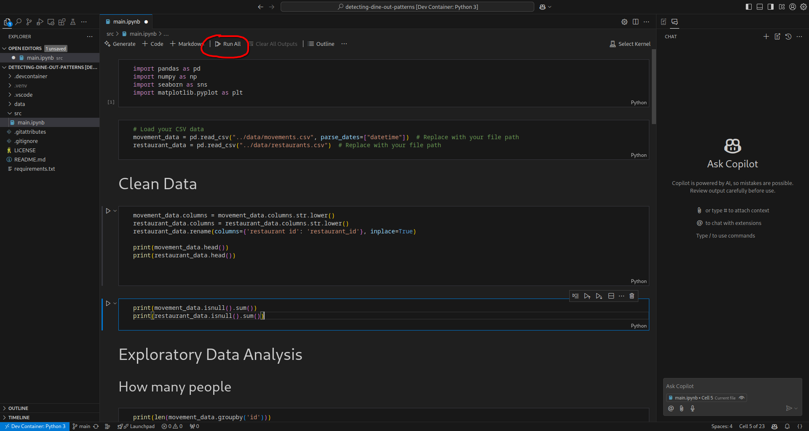
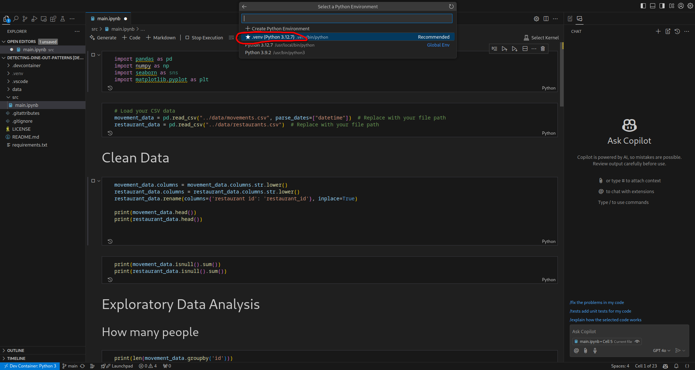

# Detecting Dine-Out Patterns

## Purpose:

The purpose of this project is to analyze patterns in restaurant visits by combining two datasets:
one containing restaurant locations and the other capturing an individual’s location data. The
objective is to determine if the individual has visited any of the restaurants and to calculate the
duration of each potential visit.

## Task:

- Combine the restaurant location dataset with the individual's location data.
- Define criteria for what constitutes a "visit," including minimum and maximum time
  spans.
- Identify restaurant visits based on the combined data and defined visit parameters.
- Calculate the duration of each visit.
- Analyze and report on dine-out patterns based on the results.

# Setup

#### 1. Clone the repo
#### 2. Open in dev container

#### 3. Wait until all dependencies are installed

#### 4. Click Run All

#### 5. Select Python Environments...

#### 6. Select .venv

#### 7. Select Install

#### 8. You're done!

